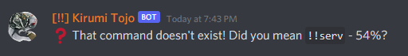
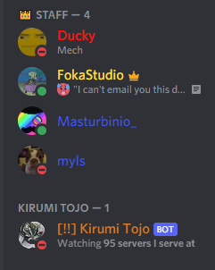
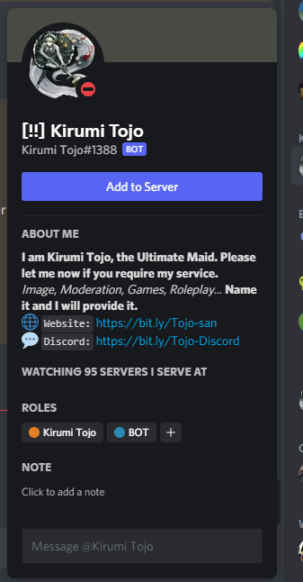
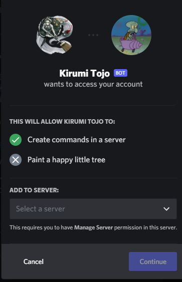
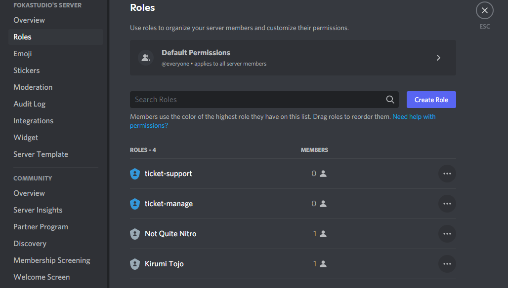
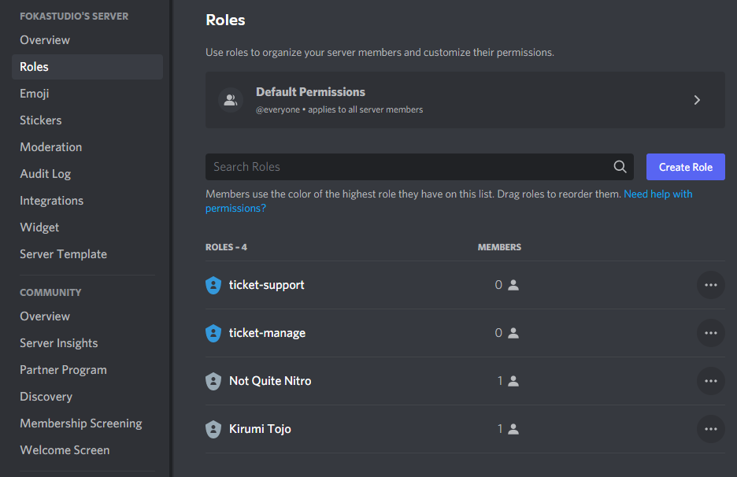
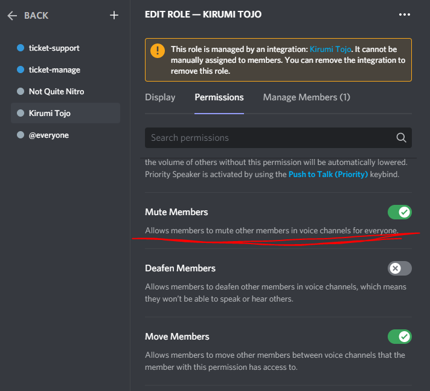

# FAQ

## I turned on talking functions and I can't turn them off! What do I do!

Just run `!!talk` once again and all should be fine.

Or `!!ai`, they are both the same command.

## The percentages on the similarity between the commands are nowhere near!

Yes, I am aware that running command like `!!fdsfeisjfjdsfds` will return.

For the people who are **really** interested in how this works, I suggest paying a visit [here](https://en.wikipedia.org/wiki/Jaro%E2%80%93Winkler_distance) - to see how this is actually calculated, and [here](https://github.com/FokaStudio/Kirumi-Tojo/blob/main/code/18_Similarity.sk), to see the function's origin in code.

## The bot requests 'Mute Members' permissions in a Voice Channel! Why?

I pushed an update at some point where the Bot **requires these permissions** to be able to play music in Voice Channels.

This was done because Tojo ==was initialy muted in AFK channels and she couldn't unmute herself==.

???warning "This is a temporar change!"
	Kirumi will soon distinguish between AFK channels and regular ones, so the permissions are required only there.

!!!question "How to fix this?"
	You can do 2 things:
	???example "Re-adding Kirumi"
		!!!warning
			There is no need to remove Kirumi from the server!

			This tutorial shows you how to refresh the permissions for the bot!
	
		- **Step 1: Head over to the Members List**

			
	
		- **Step 2: Locate Kirumi and click onto her to go to their profile**

			
		
		- **Step 3: Click the big `Add to server` button and re-add her to your server**

			

			!!!info ""
				This causes no data loss, it just refreshes permissions!

				So don't worry, there is no need to reconfigure everything :grin:
	
	???example "Editing permissions manually"
		- **Step 1: Head over to the Roles List**

			
	
		- **Step 2: Locate Kirumi's Role and click on it to edit it**

			
		
		- **Step 3: Allow permission `Mute Members` to Tojo-san**

			

			!!!danger "Beware the non-epic fail!"
				This can sometimes fail to work if your channels don't inherit role permissions! *(e.g. `Role A` can talk in **#general**, but not in **#general-no-a**)*

				If that is the case, you have to configure those permissions in the channel's configuration as well.
