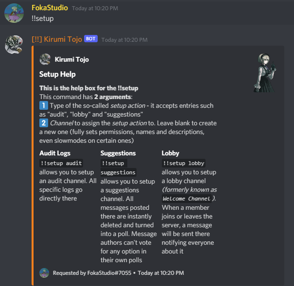
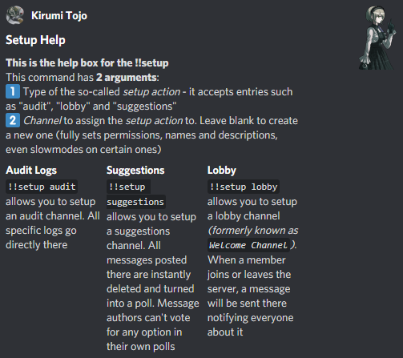

!!!warning "WIP"
	# This site is WIP! It is not advised to visit it right now!

# Setting up various features

Even if Kirumi is packed with informations, and everything is clear and descriptive, the Bot ==can get tricky to use in a matter of seconds==.

*Guess it's our Kirumi, isn't it...?*

!!!quote "TUTORIAL TIME!"
	In this tutorial of mine, you will learn how to use `!!setup` properly to configure various channel features.

## What is '!!setup'?

`!!setup` is a command used to configure channel related features, like **Suggestions**, **Audit Logging** and is partially used by **Welcomer**

This command has **2 arguments**:

- First one is for ==action type== - depends on which channel you want to create or assign an action to exiting one *(REQUIRED)*
- Second one is for ==channel== - if you leave this one empty, Kirumi will **create a new channel** specifically for the action in the previous argument. By doing `!!setup <action> #CHANNEL-NAME-HERE`, you can prevent this and just assign an action to an existing channel *(OPTIONAL)*

=== "`!!help` Index"
	
=== "Command's Help Box"
	

!!!quote "Comparison of different `!!setup` channels"
	|   | Audit | Suggestions | Lobby |
	|:---|:---:|:---:|:---:|
	| :question: Purpose | Various logs on actions such as moderation *Doesn't have that much of a use yet...* | Removing posted messages and making them into Polls instead | Posting Join and Leave messages |
	| :grey_question: Command | `!!setup audit`  | `!!settup suggestions`  | `!!setup lobby` |
	| :white_check_mark: Allowed Permissions | :x: | Send Messages | View Channel|
	| :negative_squared_cross_mark: Denied Permissions | View Channel | Add Reactions | Send Messages |
	| :clock1: Slowmode | :x: | 20 seconds | :x: |

*[Allowed Permissions]: Refers to @everyone role only in bot-created channels
*[Denied Permissions]: Refers to @everyone role only in bot-created channels
*[Slowmode]: Only in bot-created channels
